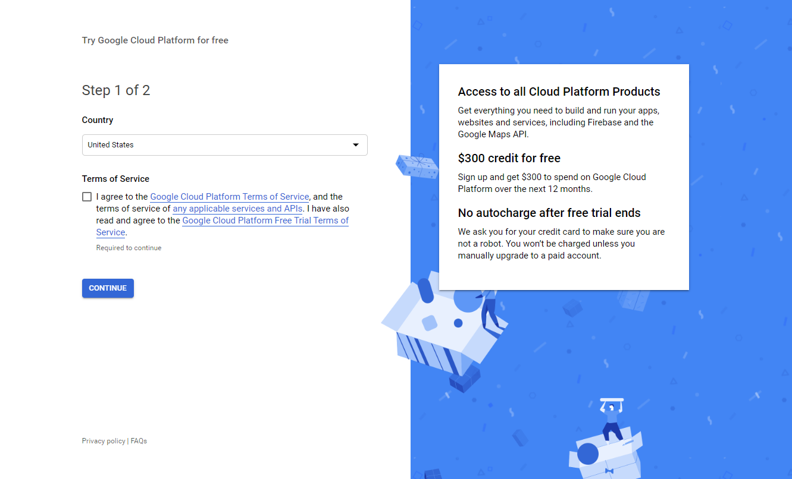
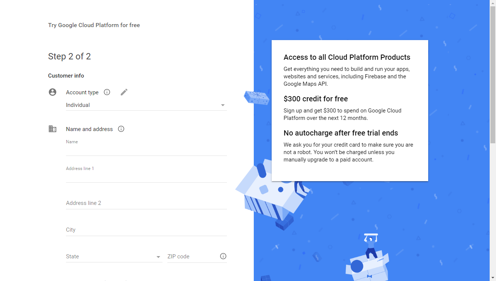
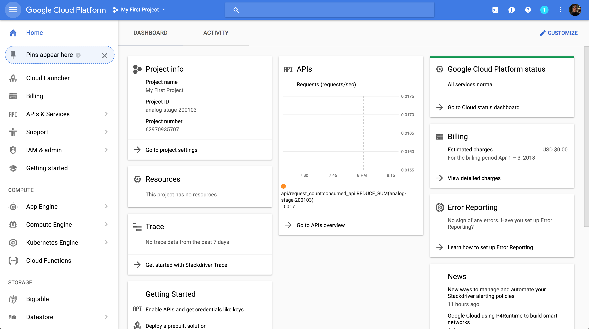
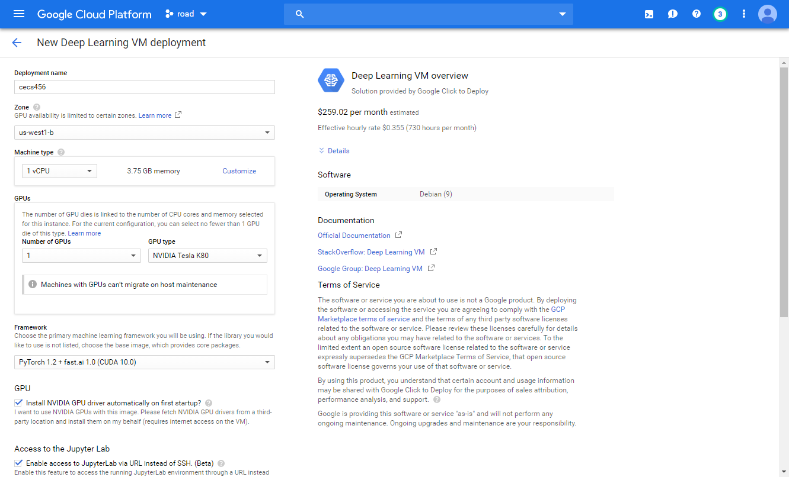
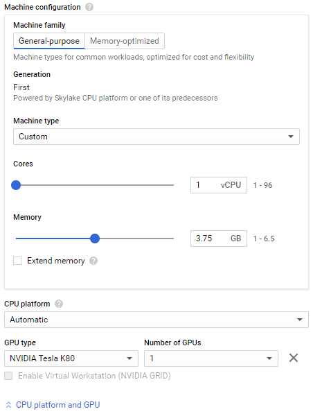

# Google Cloud Setup and Tutorial


## BEFORE WE BEGIN ##
### BIG REMINDER: Make sure you stop your instances! ###

(We know you won't read until the very bottom once your assignment is running, so we are printing this at the top too since it is ***super important***)

Don't forget to ***stop your instance*** when you are done (by clicking on the stop button at the top of the page showing your instances), otherwise you will ***run out of credits*** and that will be very sad. :(

If you follow our instructions below correctly, you should be able to restart your instance and the downloaded software will still be available.

## Create and Configure Your Account ##

For the class project and assignments, we offer an option to use Google Compute Engine for developing and testing your
implementations. This tutorial lists the necessary steps of working on the assignments using Google Cloud. **We expect this tutorial to take about an hour. Don't get intimidated by the steps, we tried to make the tutorial detailed so that you are less likely to get stuck on a particular step.**

This tutorial goes through how to set up your own Google Compute Engine (GCE) instance to work on the assignments. Each student will have $100 in credit throughout the quarter. When you sign up for the first time, you also receive $300 credits from Google by default. Please try to use the resources judiciously. But if $100 ends up not being enough, we will try to adjust this number as the quarter goes on.

First, if you don't have a Google Cloud account already, create one by going to the [Google Cloud homepage](https://cloud.google.com/) and clicking on the blue **Get started for free** button. If you are not logged into gmail, you will see a page that looks like the one below. Sign into your gmail account or create a new one if you do not already have an account.



Check the box after you have read the required agreements and press the blue **Continue** button to continue to the next page to enter the requested information (your name, billing address and credit card information). Remember to select "**Individual**" as "Account Type":



Once you have entered the required information, press the blue **Start my free trial** button. You will be greeted by a page like this:


Click the "Google Cloud Platform" (in red circle), and it will take you to the main dashboard:



To change the name of your project, click on [**Go to project settings**](https://console.cloud.google.com/iam-admin/settings/project) under the **Project info** section.


## Google Cloud VM Image

1. Go to [the gcloud marketplace](https://console.cloud.google.com/marketplace/details/click-to-deploy-images/deeplearning). You may (or may not) be taken to a page where you have to click on "Launch in Compute Engine", and then you should see a configuration sheet with the title "New Deep Learning VM deployment".
2. Fill in `Deployment name` field with your preferred VM name.
3. In `Machine type` field, change `2 vCPUs` to `1 vCPU`. You can always add more CPUs later if necessary.
4. Set `Number of GPUs` to `1`. GPUs are very expensive, so you can increase or decrease this value later. For `GPU type`, `NVIDIA Tesla K80` is typically enough for most of our assignments. `P100`, `T4`, and `V100` are way more expensive, but also faster.
5. In `Frameworks` field, choose a framework. I'm using `PyTorch 1.0 + fast.ai`, but `TensorFlow 1.14 (Intel optimized ...)` will also work if you're more familiar with TensorFlow.
6. Check the box `Install NVIDIA GPU driver automatically on first startup?`.
7. Check the box `Enable access to JupyterLab via URL instead of SSH. (Beta)`.
8. Leave all other options as default.
9. Click the blue botton `Deploy` at the end of the page.

Your configuration sheet should look similar to below:



### Change VM hardware

You can always change number of CPUs, number of GPUs, CPU memory, and GPU type after your VM has been created. It's a decent idea to develop/debug your code without a GPU and only add one on when needed to save costs.

1. You must stop the instance first.
2. Go to your VM instance's details at **Compute Engine** > **VM instances** > [click on instance name]. Click "edit" on your VM's page.
3. To change:
    * (a) the number of CPUs and memory, choose `Custom` in the `Machine type` box and play with the sliders.
    * (b) GPUs, click on the `CPU Platform and GPU` dropdown and select the number of GPUs and GPU type in the area that appears.
4. Scroll all the way down and click `Save` button.
5. Start your instance again.




### Access your newly created VM
#### Super Quick Access
The dashboard now has a button to do everything in the [Quick Access](#quick-access) step for you. This is the easiest way to get to your JupyterLab instance.

Go to the [**AI Platform** > **Notebooks**](https://console.cloud.google.com/ai-platform/notebooks/instances) page. An `OPEN JUPYTERLAB` button Your VM instance will be displayed next to each of your instances. Click it to open a new tab with your JupyterLab instance.

Congrats! JupyterLab is up and running on your gpu-enabled vm. The remaining steps walk through more advanced access.

#### Quick Access
Note: This yields the same end-result as [Super Quick Access](#super-quick-access), but if for whatever reason that's giving you problems, try this.

Instead of installing and setting up the Google Cloud SDK (see [Advanced Access](#advanced-access-optional)), Google lets you perform most commands through their Cloud Shell. Access it at any time by clicking the `Activate Cloud Shell` icon at the top-right of the page:


After deploying your VM, you should have been taken to the [Deployment Manager](https://console.cloud.google.com/dm/deployments/) page. If not, go there and select your project.

First, get the url of your instance using the `Access the running Jupyter notebook` command
(note that the commands under `Suggested next steps` are copy-and-pastable into the Cloud Shell):
```bash
gcloud compute instances describe --project "<YOUR_PROJECT_ID>" --zone "us-west1-b" "<YOUR_VM_NAME>" | grep googleusercontent.com | grep datalab
```
It will spit out something that looks like
```
value: 0123456789abcde-dot-datalab-vm-us-west1.googleusercontent.com
```
Paste the part after `value: ` into your browser and JupyterLab will open up. Note that this will only work when signed into your Google account.

Congrats! JupyterLab is up and running on your gpu-enabled vm. The remaining steps walk through more advanced access.

#### SSH into your instance (optional)
SSH access to your instance is also available through the browser. On the [VM Instances](https://console.cloud.google.com/compute/instances) page, click the `SSH` button next to your instance. A window will pop up and connect you.


#### Advanced Access (optional)
Now that you have created your virtual GCE, you might want to be able to connect to it from your computer (beyond the Cloud Shell). The rest of this tutorial goes over how to do that using the command line. First, download the Google Cloud SDK that is appropriate for your platform from [here](https://cloud.google.com/sdk/docs/) and follow their installation instructions. **NOTE: this tutorial assumes that you have performed step #4 on the website which they list as optional**. When prompted, make sure you select `us-west1-b` as the time zone.

If `gcloud` command is not in system path, you can also reference it by its full path `/<DIRECTORY-WHERE-GOOGLE-CLOUD-IS-INSTALLED>/bin/gcloud`. See [this page](https://cloud.google.com/compute/docs/instances/connecting-to-instance) for more detailed instructions.


To ssh into your VM, go to your VM instance details page by clicking on its name. Under **Remote access** at the top of the page, you may either click directly on `SSH` which will launch a new browser window with the SSH session, or click on the drop-down arrow and select `View gcloud command` instead to retrieve the terminal command. It should look like

```bash
gcloud compute --project "<YOUR_PROJECT_ID>" ssh --zone "us-west1-b" "<YOUR_VM_NAME>"
```


### Verification

If you have GPU enabled, you should be able to:

* run `nvidia-smi` and see the list of attached GPUs and their usage statistics. Run `watch nvidia-smi` to monitor your GPU usage in real time.


## BIG REMINDER: Make sure you stop your instances! ##

Don't forget to stop your instance when you are done (by clicking on the stop button at the top of the [page showing your instances](https://console.cloud.google.com/compute/instances)). You can restart your instance and the downloaded software will still be available.

We have seen students who left their instances running for many days and ran out of credits. You will be charged per hour when your instance is running. This includes code development time. We encourage you to read up on Google Cloud, regularly keep track of your credits and not solely rely on our tutorials.

----
This tutorial is based off of [https://github.com/cs231n/gcloud/](https://github.com/cs231n/gcloud/). Thanks, Stanford!
